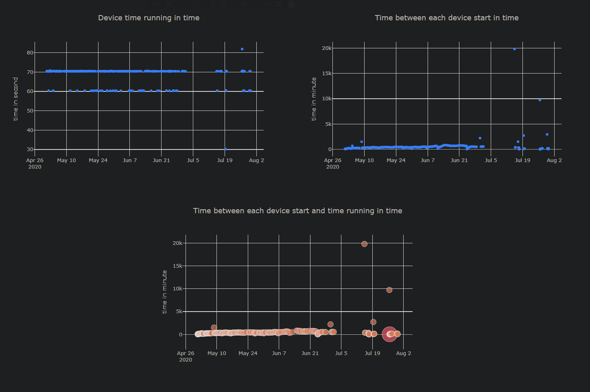

# TPLink HS110 Pump Monitor
Monitor a HS110 power so you can get notification on device start and stop.
There is also an alert if the device is idle for a long period of time and if the device runs for too long.
Usefull for a sump pump but could serve other needs.

Written in Node.js using https://github.com/plasticrake/tplink-smarthome-api and https://www.npmjs.com/package/tplink-cloud-api.
You can select if you prefer using the cloud API or Lan API.

The cloud API has some limitation on the number of calls you can do per day so it may be best to use the LAN if possible.

New UI added


# Usage 

## Using Package

Take a copy of the file example.config.json.
Rename example.config.env to config.json.
Edit the config.json to match your needs every parameter is explained in the config section.

Go in the release section and take the latest version.
https://github.com/mchenier/tplink-hs110-pump-monitor/releases

Run the program with the config.json in the same folder.

## Using Node.js

Install Node.js if you don't have it. https://nodejs.org/en/download/

```sh
$ git clone https://github.com/mchenier/tplink-hs110-pump-monitor.git && cd tplink-hs110-pump-monitor
$ npm install
```

Rename example.config.env to config.json.
Edit the config.json to match your needs every parameter is explained in the config section.

Just run this command after to start the app.
```
npm start
```

## Using Docker

```sh
git clone https://github.com/mchenier/tplink-hs110-pump-monitor.git && cd tplink-hs110-pump-monitor
```

Rename example.config.env to config.json.
Edit the config.json to match your needs every parameter is explained in the config section.

```sh
docker build -t tplink-hs110-pump-monitor .

docker run --network=host -v <localPath>:/usr/src/app/log -d tplink-hs110-pump-monitor
```

Change < localPath > to something like C:\TPLinkMonitor\tplink-hs110-pump-monitor\log

# Config

This is all parameters you must configure to make the application run. There is a file example.config.json giving you good start to setup your instance.

+ powerThreshold
    + Power at witch the device is detected to be started (I think the unit is watt).

+ aliasDevice
    + Name of your device in the TPLink app.

+ emailSender
    + Gmail account you will be using to send email.
    I strongly recommend creating a new gmail account for this app since you will have to give permission to that account for unauthorized google app.
    https://hotter.io/docs/email-accounts/secure-app-gmail/

+ passEmailSender
    + Password for the sender email.

+ emailReceiver
    + Email to witch you will received the alerts. I use the same but it could be another one.

+ logFileName
    + Filename of the log. It will be appended with a .log.

+ idleThreshold
    + Number of time in second the pump can be idle before you get an alert.

+ repeatRunningAlertEvery
    + Time in second between each of running alert message in a period of alert threshold exceeded.

+ repeatIdleAlertEvery
    + Time in second between each of idle alert message in a period of alert threshold exceeded.

+ deviceRunningTimeThreshold
    + Alert if the device running for more that threshold in second each time it starts.

+ nbLineLogEmail
    + Number of line of the log to send in the email.

+ waitBetweenRead
    + Thats the time between each poll to the power of the device in second.

+ enableIdleAlert
    + Enable alerts when idle for too long. Possible value: on, off

+ enableRunningAlert
    + Enable alerts when running for too long. Possible value: on, off

+ enableStartAlert
    + Enable alerts when device start. Possible value: on, off

+ enableStopAlert
    + Enable alerts when device stop. Possible value: on, off

### LAN API related

+ deviceIP
    + IP of the device you want to monitor. If set to 0.0.0.0 will search for it but I don't recommend it. Was made available because of problem with the search device api.

### Cloud API related

+ apiSelection
    + Use tplink-cloud-api if set to cloud otherwise use tplink-smarthome-api. Other parameters below only usefull for cloud API.
    cloud and lan should be use

+ userTpLink
    + Username to connect in TPLink app.

+ passTpLink
    + Password to connect in TPLink app.

# Graph / UI

I added a first draft of UI in React with Plotly to plot the data I stored in the device_graph.csv.
To see the UI just execute the following commands.

```sh
$ cd ui
$ npm install
$ npm start
```

You can run both the monitoring app and the ui at the same time. The ui won't refresh witht he new data automatically but a browser refresh will do for now.

# Package

If you want to make a package. I used the pkg utiliy (https://github.com/zeit/pkg)

```
npm install -g pkg
```

Go in command line in the project directory and type the following.

```
pkg .
```

Just have a config.json in the same directory has the executable and execute it.

# Alert / Log

+ Alert when device start.
+ Alert when device stop.
+ Alert when device runs for too much time.
+ Alert when device is idle for too much time.
+ Reminder alert for device idle and running pass the threshold.

You can find logs in the ./log folder. 

Every alert an email is sent to the email you choose. The last start/stop event will be send in the body of the message.

# Improvement

I made this little project because the need of monitoring my pump is important for me and didn't find anything else that work like I wanted.
If you want to contribute or have a good idea please let me know.
